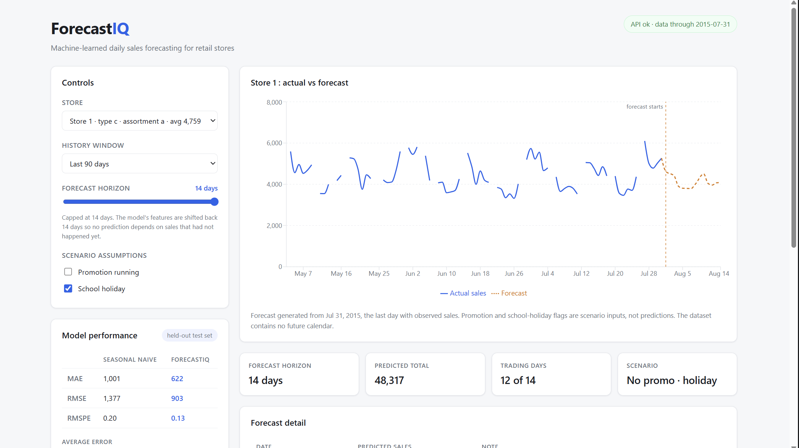
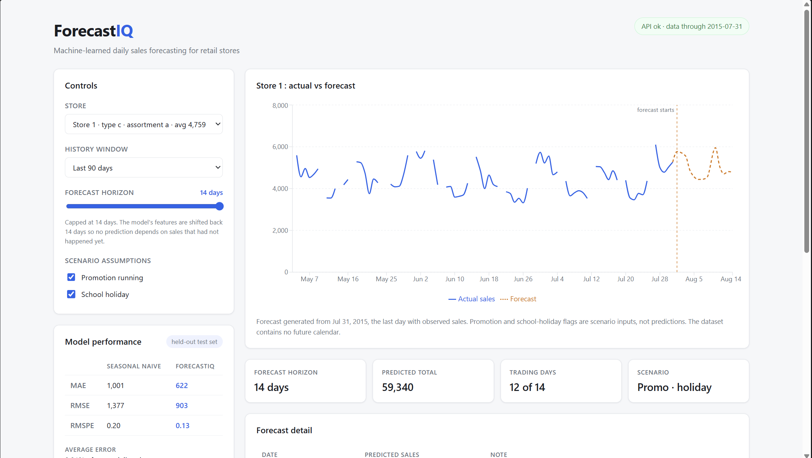
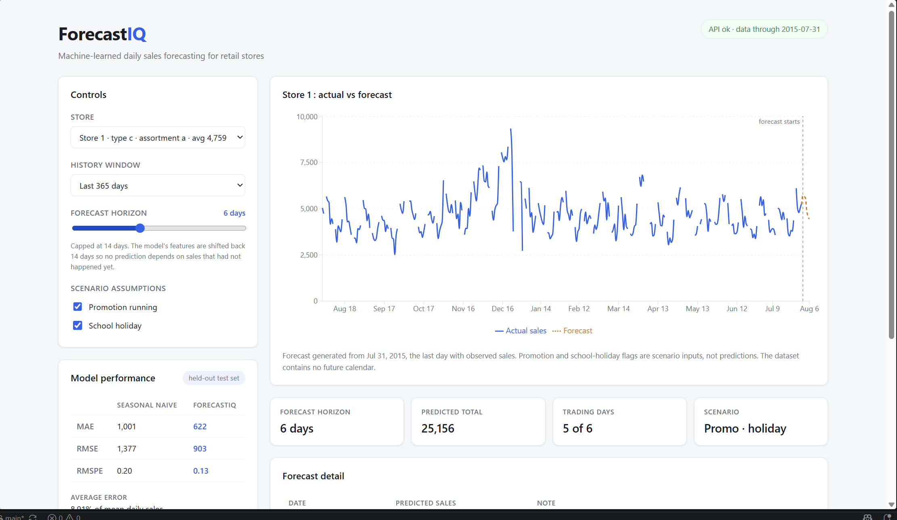
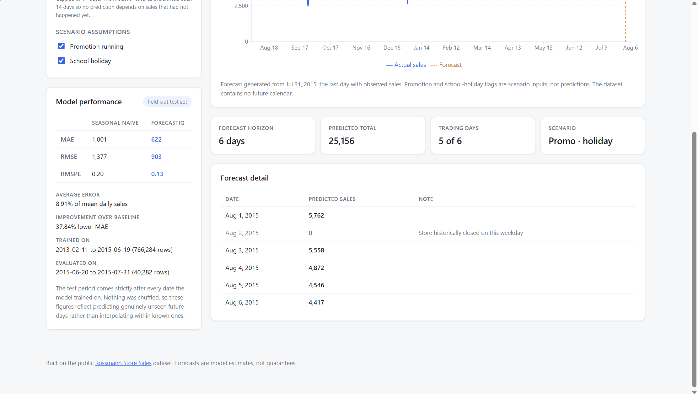

# ForecastIQ

ML-powered sales demand forecasting for retail stores. A trained gradient
boosting model served through a FastAPI backend and visualised in a React
dashboard.



---

## Overview

ForecastIQ takes 2.5 years of real daily sales data across 1,115 retail stores,
engineers time-series features from it, trains a regression model with a
time-aware train/test split, and serves per-store forecasts through a REST API.
A React dashboard plots observed sales against predicted sales and lets you
change the forecast scenario.

The whole pipeline runs locally: download the data, train the model, start the
API, open the dashboard.

## Problem

Retailers have to decide how much stock to hold and how many staff to roster
before they know what demand will be. Guess high and you tie up cash in
inventory that sits on shelves. Guess low and you lose sales you could have
made. The signal needed to do better is already in the historical data
(weekday patterns, promotion effects, school holidays, seasonality, store-level
differences), but it is not usable in raw form.

The harder problem is methodological. Sales data is a time series, and the
obvious ways of building a forecasting model quietly break it:

- A random train/test split lets the model learn from days that come *after*
  the days it is scored on. The reported accuracy is then meaningless.
- Features built from same-day measurements leak information that would not
  exist at the moment a real forecast is made.
- A single error number with nothing to compare it against says nothing about
  whether the model is doing anything useful.

## Solution

A pipeline that is explicit about all three:

1. **Time-based split.** The final 6 weeks of the timeline are held out. The
   model is only ever scored on dates strictly later than everything it trained
   on.
2. **Horizon-shifted features.** Every lag and rolling window is shifted back by
   the forecast horizon, so a prediction for any day in the horizon depends only
   on sales that had already been observed when the forecast was made. This is
   asserted by a test, not just claimed in a comment.
3. **A baseline to beat.** Every metric is reported next to a seasonal-naive
   baseline (average of the same weekday over the three most recent comparable
   weeks).

## Features

- Automated dataset download via the Kaggle API, with clear failure messages for
  missing credentials and unaccepted competition terms
- Cleaning that reconstructs a dense daily panel so lag features are true
  calendar lags rather than row offsets
- Reusable feature engineering shared byte-for-byte between training and
  inference, so there is no second implementation to drift out of sync
- Time-aware training with honest MAE / RMSE / RMSPE reporting against a baseline
- REST API for store listings, sales history and forecasts
- Interactive dashboard: store selector, adjustable history window, forecast
  horizon slider, and promotion / school-holiday scenario toggles
- Graceful degradation. A missing or unloadable model file leaves the API
  running and serving history, with the reason exposed on `/api/health`
- 22 tests covering feature correctness, data leakage, and API failure paths

## Technologies

**Backend:** Python 3.12, FastAPI, Pydantic, Uvicorn
**ML / data:** scikit-learn, pandas, NumPy, joblib
**Frontend:** React 18, Vite, Recharts, plain JavaScript
**Tooling:** pytest, Kaggle API, Git

## Data source

[Rossmann Store Sales](https://www.kaggle.com/competitions/rossmann-store-sales),
a public Kaggle dataset of daily sales for 1,115 Rossmann drug stores across
Germany.

| | |
|---|---|
| Rows | 1,017,209 |
| Stores | 1,115 |
| Date range | 2013-01-01 to 2015-07-31 |
| Per-day fields | sales, customers, open/closed, promotion, state holiday, school holiday |
| Per-store fields | store type, assortment, competitor distance, competitor opening date, Promo2 participation |

**Usage terms.** The data is distributed under the Rossmann Store Sales
competition rules, which require accepting the terms on Kaggle before download
and do not permit redistribution. The CSVs are therefore **not committed to this
repository**. `backend/data/raw/` is gitignored, and `backend/data/download.py`
fetches them via the Kaggle API. Anyone reproducing this project downloads their
own copy under their own Kaggle account.

## Architecture

```
forecastiq/
├── backend/
│   ├── app/
│   │   ├── main.py          FastAPI routes (thin: validate, call service, respond)
│   │   ├── service.py       data + model access, forecast construction
│   │   └── schemas.py       Pydantic request/response contracts
│   ├── data/
│   │   ├── download.py      Kaggle API download
│   │   ├── clean.py         cleaning, dense daily panel construction
│   │   └── raw/             downloaded CSVs (gitignored)
│   ├── ml/
│   │   ├── config.py        paths, horizon, feature lists (single source of truth)
│   │   ├── features.py      feature engineering shared by training and inference
│   │   ├── train.py         training, evaluation, artifact persistence
│   │   └── model.pkl        trained model (gitignored, regenerate with train.py)
│   ├── scripts/
│   │   └── inspect_data.py  raw data profiling
│   ├── tests/               22 tests
│   └── requirements.txt
├── frontend/
│   └── src/
│       ├── App.jsx
│       ├── api/client.js    fetch wrapper, single error-handling path
│       ├── components/      StoreSelector, ForecastControls, SalesChart,
│       │                    ModelSummary, StatusBanner
│       └── utils/format.js
└── docs/                    screenshots
```

Two boundaries are deliberate:

**Feature engineering lives in exactly one place.** `backend/ml/features.py` is
imported by `train.py` and by the API's inference path. If training and serving
computed features differently, the predictions would be wrong in a way that
produces no error and no crash, just quietly bad numbers.

**Routes never touch pandas.** All data and model work is in `service.py`.
`main.py` validates inputs, calls the service, and shapes responses.

## Running locally

**Prerequisites:** Python 3.12 (x64), Node.js, a free Kaggle account.

### 1. Environment

```bash
git clone https://github.com/rayhansadiq/forecastiq.git
cd forecastiq
py -m venv .venv
.\.venv\Scripts\Activate.ps1        # Windows PowerShell
# source .venv/bin/activate         # macOS / Linux
python -m pip install -r backend/requirements.txt
```

### 2. Kaggle credentials

1. Create a free account at [kaggle.com](https://www.kaggle.com)
2. Go to [kaggle.com/settings](https://www.kaggle.com/settings), find **Legacy
   API Credentials**, click **Create Legacy API Key** (downloads `kaggle.json`)
3. Move it to `~/.kaggle/kaggle.json` (Windows: `C:\Users\<you>\.kaggle\`)
4. Accept the competition terms at
   [the rules page](https://www.kaggle.com/competitions/rossmann-store-sales/rules).
   The download returns 403 without this.

### 3. Data and model

```bash
python backend/data/download.py     # ~39 MB
python backend/ml/train.py          # 30-90 s, writes backend/ml/model.pkl
```

### 4. API

```bash
python -m uvicorn backend.app.main:app --reload
```

Interactive docs at http://127.0.0.1:8000/docs

### 5. Dashboard

```bash
cd frontend
npm install
npm run dev
```

Open http://localhost:5173

### Tests

```bash
python -m pytest backend/tests -q
```

## API

| Endpoint | Description |
|---|---|
| `GET /api/health` | Data and model load status. Never fails. |
| `GET /api/model` | Training window, feature list, held-out metrics |
| `GET /api/stores` | All stores with date range and average daily sales |
| `GET /api/stores/{id}/history?days=90` | Observed daily sales |
| `GET /api/stores/{id}/forecast?days=14&promo=false&school_holiday=false` | Predicted daily sales |

Future promotion and school-holiday schedules are not in the dataset, so they
are **inputs rather than predictions**. The API echoes the assumptions back in
every forecast response, so a forecast is never read apart from the scenario
that produced it.

## Model methodology & evaluation

### Data preparation

Roughly 180 stores are missing about six months of 2014. Shifting by row
position across those gaps would produce lag features that are not actually
N calendar days old, while looking perfectly valid. Cleaning therefore
reindexes onto a dense (store x date) grid first, adding 33,121 filler rows
that are all flagged and excluded from training, so every lag is a true
calendar lag.

Rows excluded from training and evaluation:

| Excluded | Count | Reason |
|---|---|---|
| Gap-filled rows | 33,121 | Never actually observed |
| Closed days | 172,817 | Sales are structurally zero, not a demand signal |
| Open days with zero sales | 54 | Almost certainly recording errors |
| Incomplete history | n/a | First ~6 weeks per store, before lag windows fill |

Leaving **806,566 usable rows**.

### Features

22 features across four groups:

- **Calendar:** day of week, month, year, day of month, week of year
- **Flags:** promotion, school holiday, state holiday, Promo2 active
- **Store attributes:** store type, assortment, competitor distance, months
  since competitor opened
- **History:** sales at lags of 14 / 21 / 28 days, plus rolling mean and
  standard deviation over 7 / 14 / 28-day windows

All lags are multiples of 7, so each lands on the same weekday as the day being
predicted.

**`Customers` is deliberately excluded.** It is recorded on the same day as
sales, so it is not known at forecast time. Including it would have improved the
reported metrics substantially and made the model useless in practice.

### Avoiding leakage

The forecast horizon is 14 days, and every lag and rolling window is shifted
back by at least that much. A prediction for any day within the horizon
therefore depends only on sales already observed when the forecast was made,
with no recursive feeding of predictions back in as inputs.

This is verified mechanically rather than asserted. `test_features.py` rewrites
the last 14 days of sales to nonsense values and asserts that every feature on
every earlier row is unchanged.

The API enforces the same limit. Requesting more than 14 days returns 422 with
an explanation rather than silently extrapolating.

### Split

The final 42 days are held out. Nothing is shuffled.

| | Period | Rows |
|---|---|---|
| Train | 2013-02-11 to 2015-06-19 | 766,284 |
| Test | 2015-06-20 to 2015-07-31 | 40,282 |

### Model

`HistGradientBoostingRegressor` (400 iterations, learning rate 0.08). Chosen
over the classic `GradientBoostingRegressor`, which is sequential and does not
scale comfortably to 766k rows. The histogram-based implementation trains in
about 30 seconds. `RandomForestRegressor` is available via
`python backend/ml/train.py --model rf`.

### Results

Held-out test set (40,282 rows, 2015-06-20 to 2015-07-31):

| Metric | Seasonal naive | ForecastIQ |
|---|---|---|
| MAE | 1,000.6 | **622.0** |
| RMSE | 1,377.3 | **902.6** |
| RMSPE | 0.1954 | **0.1286** |

Mean actual daily sales on the test set: **6,978.6**

- Average error is **8.91%** of mean daily sales
- **37.8%** lower MAE than the seasonal-naive baseline

**Honest assessment.** The model clearly beats a sensible baseline, and the
methodology is sound. It is not a competitive result in absolute terms. The
original Kaggle competition's leading entries reached roughly 0.10 RMSPE using
heavier feature engineering and model ensembling. Those figures are also not
directly comparable, since the competition scored a six-week future window on a
different holdout. This project prioritised a correct, explainable pipeline
over score chasing.

RMSE (903) sitting meaningfully above MAE (622) indicates the error
distribution has a tail. Most days are predicted well, with occasional larger
misses, likely around holidays and unusual promotion periods.

### What the model relies on

Permutation importance on the held-out set, top 5:

| Feature | Importance |
|---|---|
| `Promo` | 550.4 |
| `SalesLag14` | 449.5 |
| `SalesLag28` | 224.2 |
| `SalesRollMean28` | 219.6 |
| `SalesLag21` | 164.3 |

Promotions dominating recent sales history matches how retail actually behaves,
which is a reasonable sign the model learned real structure rather than noise.

## Screenshots

**Dashboard: observed sales flowing into a 14-day forecast.** The observed line
breaks into segments because days the store was closed are plotted as gaps
rather than zeros. A shut store has no demand signal, and drawing it as zero
would bury the weekly trend under a row of spikes.


**The same store and period with promotions switched on.** Everything else is
held constant, and the predicted 14-day total rises from 48,317 to 59,340, a
23% increase. That is consistent with `Promo` being the model's strongest
feature by permutation importance.


**A full year of history, showing the December seasonal peak, with the forecast
horizon shortened to 6 days.**


**Model performance and day-by-day forecast detail.** Days the store is
historically closed are forecast at zero and labelled.


## Limitations

- **14-day horizon.** Forecasting further out would require feeding predictions
  back in as inputs, which compounds error and is not implemented here.
- **Future calendars are assumptions.** Promotion and school-holiday flags are
  supplied by the caller, not predicted.
- **Point forecasts only.** No prediction intervals, so the output conveys no
  uncertainty.
- **Local only.** No deployment, containerisation, or authentication.
- **Data ends in 2015.** Forecasts begin from 2015-08-01, the day after the
  dataset's final observation.
- **Store closures are handled heuristically.** A store open on under 10% of a
  given weekday historically is treated as closed and forecast at zero.

## Future improvements

- Prediction intervals via quantile regression, so forecasts carry uncertainty
- Walk-forward cross-validation across several time origins rather than one
  holdout, for a more stable estimate of accuracy
- Per-store or per-store-type models, since store scale varies widely
- Explicit holiday-proximity features (days until or since a state holiday)
- Cache the cleaned panel to Parquet to cut API startup from ~20s to under a second
- Containerise and deploy so the dashboard is publicly viewable

## What I learned

**Time series break the usual ML habits.** My instinct was `train_test_split`.
On temporal data that trains on the future to predict the past and produces
metrics that look great and mean nothing. Splitting by date, and understanding
*why*, was the most important thing I took from this project.

**Leakage is silent.** Nothing crashes when a feature contains information that
would not exist at prediction time. You just get an excellent score and a
useless model. Excluding `Customers` cost me accuracy on paper and was
obviously correct. Writing a test that tampers with future sales and asserts
past features are unchanged turned "I think this is right" into something
verifiable.

**Data cleaning decisions have consequences that stay invisible until you look
for them.** The six-month gap in 2014 would have silently corrupted lag features
for 180 stores. Nothing would have errored. Reconstructing a dense date grid
first was a small change that mattered a lot.

**A metric without a baseline is not a result.** MAE 622 is meaningless alone.
MAE 622 against a seasonal-naive 1,000 is a claim you can defend.

**Environment setup is real engineering work.** I'm on a Snapdragon
(Windows-on-ARM) machine and installed the ARM64 build of Python first.
scikit-learn only published `win_arm64` wheels from version 1.9.0, so pip fell
back to compiling from source and failed. Switching to the x64 build under
emulation fixed it. Diagnosing that meant learning the difference between the
host CPU and the interpreter's build target. `platform.machine()` reports the
former, `sysconfig.get_platform()` the latter, and only the second one predicts
which wheels pip will install.
